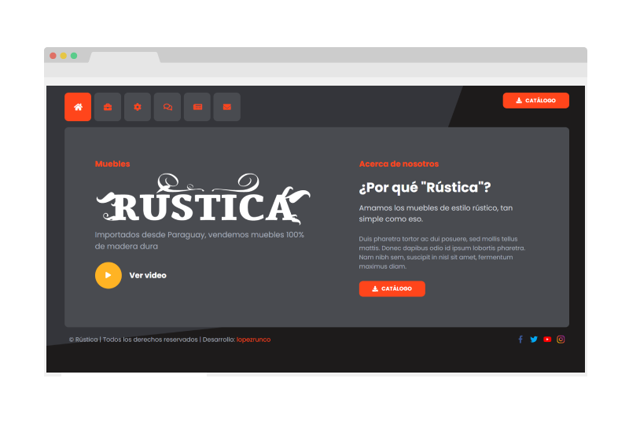

<div id="top"></div>

<!-- PROJECT LOGO -->
<br />
<div align="center">
  <a href="https://github.com/lopezrunco/MaderaRustica-Web-app-React">
    
  </a>

<h3 align="center">MaderaRustica-Web-app-React</h3>

  <p align="center">Demo web app of a Furniture sale business using React.js
    <br />
  </p>
</div>


<!-- TABLE OF CONTENTS -->
<details>
  <summary>Table of Contents</summary>
  <ol>
    <li>
      <a href="#about-the-project">About The Project</a>
      <ul>
        <li><a href="#built-with">Built With</a></li>
      </ul>
    </li>
    <li>
      <a href="#getting-started">Getting Started</a>
      <ul>
        <li><a href="#prerequisites">Prerequisites</a></li>
        <li><a href="#installation">Installation</a></li>
      </ul>
    </li>
  </ol>
</details>


<!-- ABOUT THE PROJECT -->
## About The Project



This is a demo web app to learn the basic features of React.js, such as state, components, props, jsx syntax, react router and data render

<p align="right">(<a href="#top">back to top</a>)</p>


### Built With

* React
* SASS
* Javascript
* Firebase
* Figma

<p align="right">(<a href="#top">back to top</a>)</p>


<!-- GETTING STARTED -->
## Getting Started

### Prerequisites

* node.js
* npm

### Installation

1. Clone the repo
   ```sh
   git clone https://github.com/lopezrunco/MaderaRustica-Web-app-React.git
   ```
2. Install NPM packages
   ```sh
   npm install
   ```
3. Start app
   ```sh
   npm start
   ```
4. Build app
    ```sh
    npm run build
    ```
5. Compile & deploy to firebase
    ```sh
    npm run deploy
    ```

<p align="right">(<a href="#top">back to top</a>)</p>

